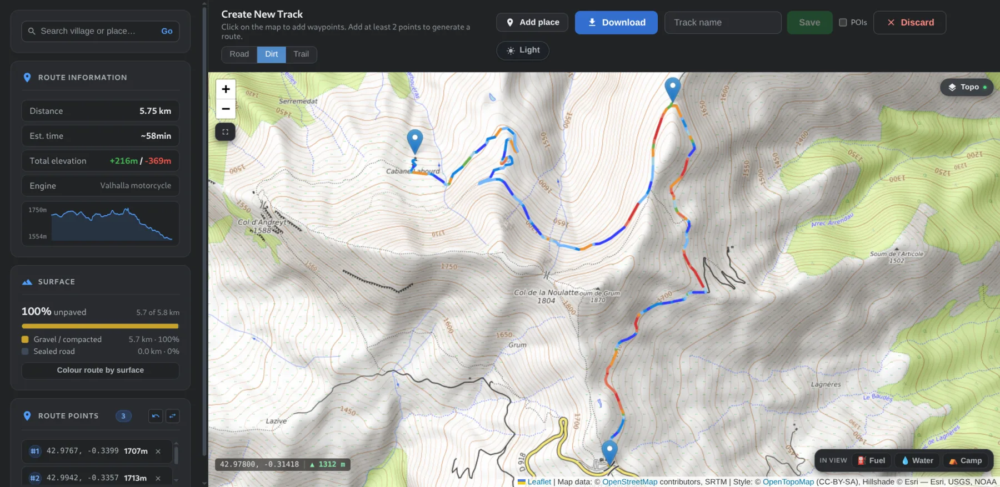

<div align="center">

# GPX Editor

**A route planner and track editor for offroad, overlanding and motorbike riding.**

Terrain-first mapping, elevation numbers that do not lie, and a real editor —
shipped as one self-contained binary.

[](https://go.dev)
[](https://react.dev)
[](go.mod)
[](LICENSE)

</div>

<p align="center">
  
</p>

---

Most GPX tools are built for road cycling or running. This one is built around
the questions you actually ask before a dirt ride: how steep is that climb, how
high does the route get, what does the terrain look like under it, how far
between fuel stops — and can I cut somebody else's 400 km Wikiloc track down to
the part I want.

- 🗺️ **Terrain-first mapping** — contours, hillshade relief, satellite, and live
  ground elevation under the cursor
- 📐 **Honest numbers** — elevation gain that filters GPS noise instead of
  inflating totals by 10–50%, and slope measured over real distance
- ✂️ **A real editor** — crop, split, day-stage, simplify and repair elevation
  on any track you load
- 🏍️ **Motorbike routing** — Valhalla `motorcycle` costing with road / dirt /
  trail profiles, not a repurposed bicycle model
- 📦 **One binary** — the React app is embedded in the Go server with
  `go:embed`. Copy ~7 MB to a machine and run it: no runtime, no dependencies,
  no container needed

---

## Quick start

**To build:** Go 1.22+ and Node 18+. **To run:** nothing at all.

```bash
git clone https://github.com/lalotone/overland-gpx-editor.git
cd overland-gpx-editor
make            # installs npm deps, builds the frontend, builds the binary
./gpx-editor    # http://localhost:8000
```

That is the whole app — frontend, API and track library in one process. Tracks
live as plain `.gpx` files in `gpx/` next to the binary, so your library stays
readable by every other tool you own.

```
Usage of ./gpx-editor:
  -addr string                address to listen on (default ":8000")
  -gpx-dir string             directory holding the track library (default "gpx")
  -elevation-host string      self-hosted opentopodata-style DEM service;
                              empty uses the public Open-Meteo API
  -elevation-dataset string   DEM dataset for -elevation-host (default "srtm30m")
  -elevation-tiles            read elevation from ~30 m terrain tiles (default true)
  -elevation-tile-zoom int    tile zoom (default 13, ~14 m/px)
  -elevation-tile-cache dir   where tiles are kept (default "tiles")
```

`make cross` writes Linux, macOS and Windows binaries to `build/` — no C
toolchain needed.

> [!NOTE]
> The frontend build output is not committed, so `go install` on its own
> produces an **API-only** binary. Build with `make` to get the app.

**Working on the frontend:** run `./gpx-editor` and `npm run dev` side by side.
Vite proxies the API paths to `:8000`, so the app uses the same URLs in dev as
it does inside the binary.

**Running it as a service:** there is no authentication and CORS is open. Put
it behind a reverse proxy with auth, or keep it on a trusted network.

---

## Elevation

Out of the box the backend reads elevation from **terrain tiles** — ~30 m
Terrarium rasters, cached to `tiles/` next to the binary. Nothing to configure
and no API quota to run into.

Tiles are read locally rather than asked for a point at a time, which is why
they are the default: a 95 km route needs 27 tiles (2.6 MB) and about 5
seconds cold, then costs nothing, and a cached area keeps working with no
signal. The trade is bandwidth — tiles are ~100 KB each against a few KB of
JSON for the same route — and opening the planner zoomed out caches ~22 MB
for the region you are looking at.

While you plan, tiles for the visible area download in the background with a
progress readout on the map; pan somewhere else and it follows. Zoomed far
out the view runs to thousands of tiles, so only its middle is cached and the
readout says so. Elevation still works everywhere either way — anything not
cached is fetched on demand.

Two alternatives:

```bash
# A DEM you already run. Takes precedence over tiles.
./gpx-editor -elevation-host http://dem.lan:30110 -elevation-dataset srtm30m

# The public Open-Meteo API. No downloads, but Copernicus 90 m and a daily
# request quota — 90 m postings smooth out exactly the gradients that matter
# on a trail. One Pyrenean point reads 1539 m from it and 1920 m from 30 m
# tiles.
./gpx-editor -elevation-tiles=false
```

Whichever you use, tracks that already carry `<ele>` data display and analyse
correctly with no elevation service reachable at all.

---

## Configuration

Every value has a working default; copy `.env.example` to `.env` to change any.
Backend flags win over the environment; the `VITE_` values are baked into the
bundle at build time.

| Variable | Side | Default | Purpose |
| --- | --- | --- | --- |
| `ADDR` | backend | `:8000` | Listen address |
| `GPX_DIR` | backend | `gpx` | Track library directory |
| `ELEVATION_TILES` | backend | `on` | Read elevation from ~30 m terrain tiles; `0` falls back to Open-Meteo |
| `ELEVATION_TILE_ZOOM` | backend | `13` | Tile zoom — higher is finer and heavier |
| `ELEVATION_TILE_CACHE` | backend | `tiles` | Where tiles are kept, so elevation works offline |
| `ELEVATION_HOST` | backend | *(empty)* | Self-hosted opentopodata-style DEM. Takes precedence over tiles |
| `ELEVATION_DATASET` | backend | `srtm30m` | Dataset for `ELEVATION_HOST` |
| `VITE_API_BASE` | frontend | *(empty — same origin)* | Points the app at a backend on another host |
| `VITE_DEV_API_TARGET` | frontend | `http://localhost:8000` | Where `npm run dev` proxies the API |
| `VITE_ELEVATION_API` | frontend | *(empty — disabled)* | Optional direct DEM call if the proxy fails |
| `VITE_ELEVATION_DATASET` | frontend | `srtm30m` | DEM dataset name |

---

## Features

Full detail in **[FEATURES.md](FEATURES.md)**. In brief:

**Terrain** — OpenStreetMap / OpenTopoMap / CyclOSM / Esri satellite and shaded
relief, plus a hillshade overlay that works over any base. Track colouring by
gradient or altitude. Live ground elevation under the cursor.

**Analysis** — distance, min/max altitude, gain/loss, moving time and average
moving speed from recorded timestamps, longest gap without fuel.

**Editing** — select a range on the elevation profile, then crop or split;
day-stage splitting; reverse; Douglas-Peucker simplify to a point budget;
elevation smoothing; refetch elevation from the DEM. All undoable.

**Planning** — click waypoints, drag to adjust, route with motorbike profiles,
place search, POI layers (fuel / water / campsites).

**Files** — tolerant parsing of `<trk>`, `<rte>` and `<wpt>` across exporter
quirks; GPX 1.1 output with proper namespaces, escaping, timestamps and
waypoints preserved.

---

## How the numbers are computed

Worth reading before you trust any figure the app shows:
**[docs/ACCURACY.md](docs/ACCURACY.md)**.

The short version — elevation gain is *not* a raw sum of positive differences.
That method over-reports by 10–50% on recorded tracks because it accumulates
GPS and barometric jitter. Elevation is smoothed over a 60 m distance window,
then accumulated with a 3 m noise floor using direction hysteresis. Slope is
always measured over a real distance denominator, never between two adjacent
points.

---

## Development

```bash
make           # install deps, build the frontend, build the binary
make run       # the above, then serve on :8000
make test      # go test + npm run verify
make check     # tests plus go vet, gofmt, tsc, eslint
make cross     # release binaries for linux/darwin/windows
npm run dev    # frontend dev server with HMR (needs ./gpx-editor running)
```

Targets that need the npm toolchain install it themselves, so `make` works on a
bare clone.

How it fits together, the file tree and the HTTP API are in
**[docs/ARCHITECTURE.md](docs/ARCHITECTURE.md)**.

---

## External services

All are public and keyless. Attribution is rendered on the map by Leaflet.

| Service | Used for |
| --- | --- |
| [OpenStreetMap](https://www.openstreetmap.org/copyright) | Base map — see the [tile usage policy](https://operations.osmfoundation.org/policies/tiles/) |
| [OpenTopoMap](https://opentopomap.org) | Contour base map (CC-BY-SA, low volume only) |
| [CyclOSM](https://www.cyclosm.org) | Surface/grade base map |
| Esri ArcGIS | Satellite, relief, hillshade (attribution required) |
| [Valhalla](https://valhalla1.openstreetmap.de) | Routing, with [OSRM](https://router.project-osrm.org) as fallback |
| [Nominatim](https://nominatim.org) | Place search (max 1 request/second) |
| [Overpass](https://overpass-api.de) | Fuel / water / campsite POIs |
| [AWS Terrain Tiles](https://registry.opendata.aws/terrain-tiles/) | Elevation by default — SRTM, NED and others, public domain |
| [Open-Meteo](https://open-meteo.com/en/docs/elevation-api) | Elevation with `-elevation-tiles=false`; has a daily request quota |

These are shared community resources on donated infrastructure. The app is
built for personal-scale use and does not cache tiles or throttle aggressively.
If you point it at heavy or automated workloads, self-host the services first.

---

## Known limitations

- **No surface breakdown yet** — "% unpaved", `tracktype` / `smoothness`
  colouring. The biggest remaining gap for offroad planning.
- **No offline basemap caching.** Plan at home; the map is blank in the field.
  Elevation is the exception — `-elevation-tile-cache` keeps working offline.
- **No access warnings** — `access=private`, gates and seasonal closures are
  not flagged.
- **Desktop-shaped.** The creation screen assumes a wide window.
- **Distance is 2D**, so steep tracks read very slightly short.
- **No authentication**, and CORS is wide open. The backend reads, writes and
  deletes files in `gpx/`. Bind it to a trusted network only.

---

## Contributing

Issues and pull requests are welcome. Before opening one:

1. Run `make check` — it has to be green.
2. Read [docs/ACCURACY.md](docs/ACCURACY.md) first if you are touching
   distance, elevation or slope. The methodology there is deliberate, and
   several obvious "simplifications" are the bugs it exists to prevent.
3. Keep `src/lib/` free of React and DOM globals, and the Go backend free of
   third-party dependencies.

| Document | Contents |
| --- | --- |
| [docs/ARCHITECTURE.md](docs/ARCHITECTURE.md) | How it fits together, file tree, HTTP API |
| [docs/ACCURACY.md](docs/ACCURACY.md) | How distance, elevation and slope are computed |
| [FEATURES.md](FEATURES.md) | Complete feature reference |
| [AGENTS.md](AGENTS.md) | Conventions and workflow for coding agents |
| [.env.example](.env.example) | Every configuration variable |

---

## License

[MIT](LICENSE) © lalotone

Map data © OpenStreetMap contributors, ODbL. Tiles and routing come from the
third-party services listed above, each under its own terms.
